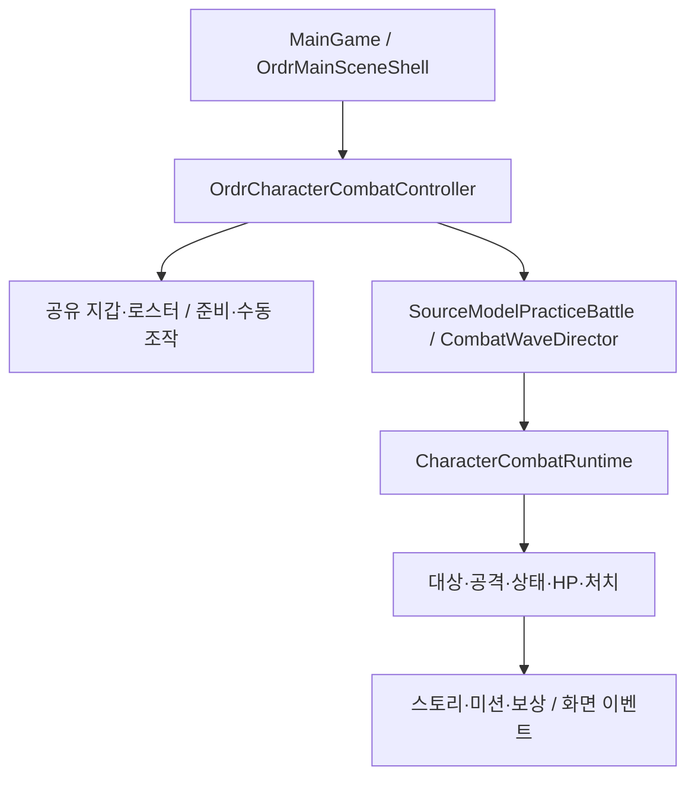

# 코드 구조

이 문서는 수정할 코드와 재사용 경계를 안내합니다. 기능 상태는 [현재 상태](START_HERE.md), 남은 작업은 [개발 작업](PLAYABLE_ROADMAP.md)에서 확인합니다.

## 실행 흐름

```mermaid
flowchart TD
  A["MainGame / OrdrMainSceneShell"] --> B["OrdrCharacterCombatController"]
  B --> C["공유 지갑·로스터 / 준비·수동 조작"]
  B --> D["SourceModelPracticeBattle / CombatWaveDirector"]
  D --> E["CharacterCombatRuntime"]
  E --> F["대상·공격·상태·HP·처치"]
  F --> G["스토리·미션·보상 / 화면 이벤트"]
```

개발용 연습과 원작 검증 경로는 공통 런타임을 사용하지만 승인 의미가 다릅니다. 모델 입력을 원본 관측 공급자로 바꿔 감싸지 않습니다.

## 영역별 진입점

아래 파일명은 저장소의 같은 이름을 검색하면 찾을 수 있습니다.

| 영역 | 파일·함수 | 책임 |
|---|---|---|
| 시작·세션 구성 | [OrdrCharacterCombatController.cs](../Assets/Scripts/Unity/OrdrCharacterCombatController.cs), [OrdrMainSceneShell.cs](../Assets/Scripts/Unity/OrdrMainSceneShell.cs) | 준비·전투·정지 시계와 동일 세션의 데이터/서비스 연결 |
| 메뉴·터치 | [OrdrMobileTouchPanel.cs](../Assets/Scripts/Unity/OrdrMobileTouchPanel.cs) | DrawUnits·DrawFusion·DrawStory·DrawWisp. 피해나 재화를 직접 계산하지 않음 |
| 유닛·조합 탐색 | MobileOwnedRosterBrowser, MobileFusionBrowser, MobileStoryDispatchBrowser | 보유 개체 선택·등급 필터·원본 재료 탐색·조합 임박. 제작 권한과 구분 |
| 전장 표시 | [OrdrUnitWorldPresenter.cs](../Assets/Scripts/Unity/OrdrUnitWorldPresenter.cs), MobileMapSkillLayout, OrdrBattlefieldArt | 고정 배경·카메라 경계·초상화·공격 이펙트. 표시 Transform과 런타임 좌표를 분리 |
| 도감·원본 객체 | [CharacterUnitCatalog.cs](../Assets/Scripts/Data/CharacterUnitCatalog.cs), [OriginalMapBaseStatCatalog.cs](../Assets/Scripts/Data/OriginalMapBaseStatCatalog.cs) | 프로젝트 ID와 원본 rawcode·공격 객체·출처 연결 |
| 전투 | [CharacterCombatRuntime.cs](../Assets/Scripts/Combat/CharacterCombatRuntime.cs), CombatAttackPipeline, CombatScheduler, CombatResolution | 공격 선언/명중·대상·HP·사망의 공통 정산 |
| 모델 스킬 | CharacterCombatRuntime.SourceModel*.cs, SourceModel*SkillCatalog | 승인된 원본/도감 패킷 실행. 같은 기술의 JASS와 툴팁 중복 실행 방지 |
| 자원·폼·소환 | SourceModelUnitResourceCatalog, SourceModelResources, SourceModelTemporarySkills, SourceModelIndependentAttacks | HP/MP·재생·폼·소환 수명·소유자·전장 변경 정리 |
| 상태·오라 | CombatStatusEngine, SourceModelUnitEffects, Original323AuraCommonRules | 상태 적용/만료·원본 정체성·중첩 경계. 아군 방어 상태와 실제 피격 공급은 별개 |
| 라운드·이동 | [SourceModelPracticeBattle.cs](../Assets/Scripts/Combat/SourceModelPracticeBattle.cs), [CombatWaveDirector.cs](../Assets/Scripts/Combat/CombatWaveDirector.cs) | 독립 웨이브·이동률·적 생존·보상·종료. Step(0)으로 잔여 계산을 소진한 뒤 다음 출현 |
| 지갑·로스터 | SharedEconomySession, EconomyTransactions, UnitRoster | 실제 인스턴스와 단일 지갑·거래 영수증·롤백 |
| 조합 | [Original323CommonFusionPort.cs](../Assets/Scripts/Mobile/Original323CommonFusionPort.cs), OriginalJassFusionPlanner, OriginalJassFusionAtomicCoordinator, OriginalFusionUnitSwap | 원본 조건 순서·재료 예약·실제 교체와 비용. 미리보기만으로 실행 허가하지 않음 |
| 위습 | MobileWispService, Original323MobileWispOutcomeWorld, OriginalWispCombatRewardWorld | 원본 풀·실물 생성·재화 차감·실패 롤백·보류된 추첨 결과 재사용 |
| 원작 피해 계약 | Ordr323DamageWorldBinding, Ordr323OriginalDamageRules, Ordr323MapDamageMath | 원본 공격·방어·면역·정수화 계약. 실제 공급자 완성 여부 별도 확인 |
| 빌드·데이터 | [OrdrCharacterDataSync.cs](../Assets/Editor/OrdrCharacterDataSync.cs), [OrdrAndroidDevelopmentBuild.cs](../Assets/Editor/OrdrAndroidDevelopmentBuild.cs) | data→Resources 동기화·필수 패킹·APK 해시 증빙 |

## 스토리와 최근 보상 연결

| 연결점 | 현재 역할 |
|---|---|
| [Original323SoloStoryScenario.cs](../Assets/Scripts/Combat/Original323SoloStoryScenario.cs) | 14개 건물·시간 제한·격파 정산. 독립 공격자의 피해는 살아 있는 원소유자에게 귀속 |
| [Original323StoryMobileProgression.cs](../Assets/Scripts/Core/Original323StoryMobileProgression.cs) | 재화·특성·연구·모바일 경험치 및 외부 원본 보상 월드 연결 |
| [Original323SourceMaterialRewardWorld.cs](../Assets/Scripts/Combat/Original323SourceMaterialRewardWorld.cs) | 고대의 배·원본 사건 재료·초월위습 선택. Original323KumaWispChoiceWorld는 기존 이름을 유지하며 여러 선택지 처리 |
| Original323KumaWispChoiceWorld.TryChoose / TryChooseBoxItem | 재화 꾸러미·쿠마·레일리+해적선과 고유 아이템 선택을 기존 지갑/로스터 거래로 처리. 영구 획득 플래그는 재료 소비 뒤에도 유지 |
| Original323MobileStoryHeroExperienceWorld | 13·14단계 XP를 현재 대상별로 기록. 최신 조건은 원본 H*** 영웅과 A07O 보유. 실제 레벨/성장 효과는 미완 |
| [CharacterCombatRuntime.StoryGreenBlood.cs](../Assets/Scripts/Combat/CharacterCombatRuntime.StoryGreenBlood.cs), [Original323StoryGreenBloodRules.cs](../Assets/Scripts/Combat/Original323StoryGreenBloodRules.cs) | 직접 선택한 실물 유닛의 변환/강화. 같은 종류 여러 기 중 선택 개체만 처리 |
| Original323FusionSourceItemLedger, Original323StoryNativeRewardQueue | 고유 아이템 잔액·영구 획득 기록과 단계별 영수증. 커밋 후 알림 예외로 재지급하지 않음 |

5% 원본 고유 보상과 XP 자격의 출처는 [스토리 원본 근거](../data/original-2323C-story-native-reward-evidence.json)에 있습니다. 현재 수치/자격은 이 문서에 복제하지 않고 해당 코드와 자료를 함께 대조합니다.

## 수정 전 확인할 경계

- 새 효과를 넣기 전에 원본 객체·능력 소유·JASS 함수·타깃·시점·피해 타입과 기존 처리기를 찾습니다. 툴팁 등록은 실행 명세 전체가 아닙니다.
- 소유자 제거·조합·판매·폼 변경·파견 이동 때 예약 공격과 상태를 정리합니다. 지연 공격은 선언 당시 전장 리비전을 확인합니다.
- 지갑 커밋 뒤 관찰자 예외와 커밋 전 실패를 구분합니다. 영수증이 확정된 거래는 재지급하지 않습니다.
- 위습 자동 정산은 컨트롤러의 deferAutomaticUntilFlush/FlushAutomaticSafely 경계를 유지합니다. 보류된 추첨 결과를 실패마다 다시 뽑지 않습니다.
- 최적화는 측정 뒤 진행합니다. 대상 선정·난수 호출 순서·효과 만료·처치 보상·거래 잠금을 바꾸지 않습니다.
- 캐릭터 초상화는 개인용 Resources 우선, 없으면 HTTPS 다운로드/기기 캐시와 대체 아이콘을 사용합니다. [개인용 이미지 안내](PRIVATE_PORTRAIT_BUILD.md).

## 검사와 현황 자료

- `Assets/Tests/EditMode/`: C# 전투·거래·화면 경계 검사.
- `tests/`: JSON·원본 감사·연결 계약 회귀.
- `tools/build_character_runtime_coverage.py`: 확장/변신 카탈로그 집계. 최신 저장 결과는 재생성이 필요합니다.
- `tools/build_unit_runtime_status.py`와 `tools/render_unit_status_docs.py`: 실제 C# 지원 내보내기 기반 현황·유닛 표 생성.

실행 허가와 명령은 [작업 규칙](../AGENTS.md)·[실행과 APK](unity-editmode-test.md)에 있습니다.
